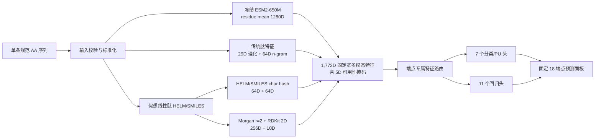

# Peptide-OmniPanel V31 最新模型架构、模型输入、训练方法与 18 端点结果

> 文档版本：2026-07-23  
> 冻结数据/模型日期：2026-07-22  
> 模型包：`models/peptide_omnipanel_v31/release_peptide18_a3_20260722`  
> 模型包 ID：`peptide-omnipanel-v31-peptide18-49d2edb6bd0a4250a893b1f7b8e9bf74`  
> 范围：仅肽、修饰肽和环肽来源；`small_molecule_teacher_rows=0`  
> 状态：18/18 端点均有本地输入依赖预测器，但 18/18 均尚未完成独立外部验证；全部仅供内部科研。

## 1. 一页结论

- **输入一条规范氨基酸序列，可以固定返回 18 个端点的动态预测值。** 网站批量层可接收最多 32 条序列，逐条调用同一个核心模型。
- 当前不是“一个共享多任务神经网络头”，而是 **共享冻结 ESM2/传统/二维化学表示 + 18 个端点独立树模型头**。每个端点用分组 OOF 在可用特征路线中自行选路。
- 蛋白质语言模型已实际投入：`facebook/esm2_t33_650M_UR50D`，冻结 revision，residue-mean 池化得到 1,280D。
- 完整特征行宽 1,772D；训练时可使用原始 sequence/HELM/SMILES，网站只有裸序列时会确定性生成一个“天然 L、未修饰、线性、游离 N/C 端”的假想 HELM/SMILES。
- 冻结训练集为 **30,507 个端点-分子-条件案例、17,444 条唯一规范序列**；直接测量/数值阈值案例 12,363，弱标签/来源定义/PU 案例 18,144。
- 表现最应谨慎解读的端点是 F、CL、Vd、membrane retention、mouse plasma stability；较有开发信号的端点包括 hemolysis、PAMPA permeability、HC50、intestinal stability 和 T₁/₂，但仍不是外部验证成绩。

## 2. 当前系统架构



### 2.1 架构边界

- **已实现**：冻结 ESM2-650M、传统序列特征、HELM/SMILES 字符特征、Morgan 指纹、RDKit 2D 描述符、端点级 LightGBM/ExtraTrees 预测头。
- **尚未实现**：端到端 ESM2 微调、LoRA/adapter、1D-CNN/BiGRU/Transformer token mixer、GNN/MPNN、真实 3D 构象网络、共享多任务 trunk。
- 当前选择树模型头，是因为 18 个端点的数据量从 12 到 11,036 行不等，条件和标签语义差异很大；直接共享一个深度头容易让大端点压制小端点并引入标签污染。

### 2.2 特征组成与路由

| 特征块 | 维度 | 生成方式 |
|---|---:|---|
| traditional | 93 | 29 个长度/组成/疏水/芳香/极性/带电/净电荷等理化特征 + 64 个稳定 signed 字符 n-gram |
| ESM2 residue mean | 1,280 | 冻结 `esm2_t33_650M_UR50D`，去除 special tokens 后按残基平均 |
| HELM 字符哈希 | 64 | 1–3 gram stable hash |
| SMILES 字符哈希 | 64 | 1–3 gram stable hash |
| Morgan 指纹 | 256 | RDKit，radius=2 |
| RDKit 2D 描述符 | 10 | 从可解析 SMILES 计算 |
| modality availability | 5 | sequence/ESM/HELM/SMILES/RDKit 是否真实可用 |
| **合计** | **1,772** | 固定宽、float32、有限值合同 |

| 路由 | 切片 | 实际维数 | 入选端点数 |
|---|---|---:|---:|
| traditional | `[0:93]` | 93 | 1 |
| esm_sequence | `[0:1373]` | 1,373 | 8 |
| structure | `[1373:1772]` | 399 | 6 |
| multimodal | `[0:1772]` | 1,772 | 3 |

这里的 structure 分支包含 HELM/SMILES/Morgan/RDKit/availability，不包含 ESM2；multimodal 才是全特征拼接。

## 3. 模型输入合同

### 3.1 核心模型的公开输入

- 单次核心推理：一条 plain peptide sequence。
- 自动去空白并转为大写。
- 仅接受 20 种规范氨基酸字母：`ACDEFGHIKLMNPQRSTVWY`。
- 长度必须为 1–1,024 aa；不截断，越界直接拒绝。
- 网页批量层支持文本、FASTA/FA/FAA/TXT/CSV/TSV，最多 32 条、文件最多 1,000,000 bytes；批量层只是逐条复用同一核心模型。

### 3.2 裸序列的化学假设

```text
natural_L_unmodified_linear_free_N_and_C_termini
= 天然 L-氨基酸、未修饰、线性肽、游离 N 端和 C 端
```

因此，裸序列不能表达真实环化、D-AA、N/C 封端、脂化、PEG 化、非天然单体、特定二硫键拓扑等。对修饰敏感端点，网站结果对应“假想未修饰线性类似物”，不是原始修饰分子的直接预测。

### 3.3 训练输入与网站输入的区别

| 场景 | sequence | HELM | SMILES/RDKit | 解释 |
|---|---|---|---|---|
| 训练数据 | 可缺失 | 可来自原始记录 | 可来自原始化学结构 | 尽可能保留真实修饰/结构；缺失由 availability mask 显式标记 |
| 网站裸序列推理 | 必须有 | 由序列生成 | RDKit 由序列生成线性天然 L 肽 | 是假想未修饰线性结构，不等于真实修饰肽 |

## 4. 冻结训练数据

| 项目 | 数量 |
|---|---:|
| 端点 | 18 |
| 端点-分子-条件案例 | 30,507 |
| 唯一规范序列 | 17,444 |
| classification 行 | 17,290 |
| regression 行 | 9,433 |
| positive-unlabeled 行 | 3,784 |
| 直接测量/数值阈值案例 | 12,363 |
| 弱标签/来源定义/PU 案例 | 18,144 |
| 可计算 sequence/ESM 行 | 23,410 |
| 有 HELM 行 | 12,265 |
| 有非空 SMILES 行 | 7,387 |
| RDKit 可解析行 | 7,060 |
| 小分子 teacher 行 | **0** |

30,507 是案例数，不是 30,507 条互不重复肽。一个分子可在不同端点、实验条件或来源中形成多行；验证按 `validation_group` 分组，不做普通随机行拆分。

### 4.1 冻结来源层

| 冻结输入 | 作用 | SHA-256 |
|---|---|---|
| `configs/peptide_omnipanel_v31_peptide18_endpoint_registry.json` | 18 端点任务语义、单位、条件及证据等级注册表。 | `dfe6447047495972968142459b40420974d0e3ea3ee35a826bc3de45b5a0e7c7` |
| `data/esm2_peptide_t12_pilot/peptide_t12_labels_and_splits.tsv` | PEPlife2 派生的 T₁/₂ ≥ 1 h 冻结标签及分组。 | `80d72902a04ccbb2c4d78f0b09ef0ff24f2eac172e92cb4c3ca18d1d459a35f0` |
| `data/peptide_hemolysis_binary_pilot/hemolysis_labels_and_splits.tsv` | DBAASP 派生的溶血阈值标签、来源及分组。 | `fdff0831fe243e668127f57abd3bded7305d6a02cbb23c8e79203093d3c06358` |
| `data/peptide_ml_cleaning_v1/binary_evidence_catalog.tsv` | 肽类二分类证据目录：solubility、BBB、toxicity、cytotoxicity 等弱/来源定义任务。 | `530aac80fe7a913d2e94e5565e625d58677c61a334639165e47948e886e8ef9f` |
| `data/peptide_ml_cleaning_v1/positive_unlabeled.tsv` | cell penetration：正样本与肽域未标注背景。 | `5ac80dd4476e0d6116255b1c0eacd57d85d991140e0d6ca781ad01588fb42e8f` |
| `data/peptide_ml_cleaning_v1/strict_numeric.tsv` | 严格数值清洗层：LogD、F、PPB、CL、Vd、permeability、plasma stability 等。 | `408edbc4dfae7218068cda49a9cfb7f41cea6459f7310b91b34b8a7e583a3906` |
| `data/peptide_omnipanel_v28_research_data_20260719_run1/observations.tsv` | 既有肽域研究观测：HC50、intestinal stability 等补充。 | `94b4837be4f10ee7cb1a51d38272cc353e9c98ccbabb928235adb73ebee42c9a` |

UniProt 主要适合序列、身份和功能追踪，通常不直接给出可统一建模的 LogD、F、CL、Vd、PPB、PAMPA、HC50 等定量 ADMET 标签；V31 的定量标签来自论文补充表、PEPlife2、DBAASP/HemoPI2/TPDB 及内部严格清洗层，而不是把 UniProt 注释误当作定量 ADMET。

### 4.2 证据层分布

| evidence lane | 案例数 |
|---|---:|
| `weak_binary` | 11,880 |
| `direct_measured_structure_conditioned` | 7,495 |
| `positive_unlabeled` | 3,784 |
| `source_defined_binary` | 2,480 |
| `direct_source_resolved_binary` | 2,012 |
| `direct_measured_single_source` | 1,926 |
| `direct_measured` | 918 |
| `direct_measured_structure_only` | 12 |

## 5. 训练方法

### 5.1 冻结表示计算

- ESM2：`facebook/esm2_t33_650M_UR50D`，revision `08e4846e537177426273712802403f7ba8261b6c`。
- 编码器完全冻结；本轮不反向传播、不端到端微调。
- pooling：`mean_residue`，输出 1,280D float32；训练缓存同时生成过 max pooling，但 V31 头只使用 mean pooling。
- RTX 5080、BF16、本地离线权重；17,444 条序列的 ESM 缓存耗时 92.59 秒，峰值 CUDA allocated 1461.2 MiB，OOM fallback=0。

### 5.2 端点级候选路线

- sequence 覆盖率 ≥25%：候选 `traditional`、`esm_sequence`。
- HELM 或 SMILES 覆盖率 ≥25%：候选 `structure`。
- sequence 与 structure 覆盖率均 ≥10%：增加 `multimodal`。
- 若上述均不满足：回退 `multimodal`。
- `cell_penetration` 只比较 `traditional` 与 `esm_sequence`，避免“正样本有 HELM、未标注背景无 HELM”造成模态可用性泄漏。

### 5.3 分组 OOF 与路线选择

- 固定种子：`20260722`；每折模型使用 `seed + fold`。
- 折数：`min(3, unique_validation_groups)`，至少 2 折。当前所有端点均使用 3 折。
- 分类与 PU：`StratifiedGroupKFold(shuffle=True, random_state=20260722)`。
- 回归：`GroupKFold`。
- 分组键：优先 `validation_group`，缺失时回退 `exact_identity_group`。
- 分类/PU 路线以 **最大 ROC-AUC** 选优；回归路线以 **最小 MAE** 选优。
- 分类阈值固定 0.5，仅用于计算 Balanced Accuracy；未做独立阈值调优或概率校准。
- 路线选定后，在该端点全部训练行上重拟合一个最终预测头；OOF 文件单独保留用于开发指标复算。

### 5.4 预测头超参数

| 条件 | 模型 | 冻结超参数 |
|---|---|---|
| 分类/PU，端点总行数 ≥500 | LightGBM classifier | `n_estimators=220, learning_rate=0.04, num_leaves=31, max_depth=-1, min_child_samples=max(10,min(40,n//100)), subsample=0.8, colsample_bytree=0.65, reg_lambda=1.0, n_jobs=4` |
| 分类/PU，端点总行数 <500 | ExtraTrees classifier | `n_estimators=300, max_features=sqrt, min_samples_leaf=1, class_weight=balanced, n_jobs=4` |
| 回归，端点总行数 ≥500 | LightGBM regressor | `n_estimators=260, learning_rate=0.035, num_leaves=31, max_depth=-1, min_child_samples=max(10,min(40,n//100)), subsample=0.8, colsample_bytree=0.65, reg_lambda=1.0, n_jobs=4` |
| 回归，端点总行数 <500 | ExtraTrees regressor | `n_estimators=300, max_features=0.7, min_samples_leaf=1, n_jobs=4` |

最终模型家族分布：`LGBMClassifier=6`、`ExtraTreesClassifier=1`、`LGBMRegressor=2`、`ExtraTreesRegressor=9`；18 个头合计 9.99 MiB。使用已冻结特征缓存完成分组 OOF、选路和最终头拟合耗时 153.62 秒。

注：上表中的 `n` 是每次拟合实际看到的训练行数；OOF 阶段是该折训练行数，最终重拟合阶段是端点全量行数。

### 5.5 输出变换与误差摘要

- F、PPB、membrane retention：输出裁剪到 `[0,1]`。
- CL、Vd：裁剪为非负。
- 其余端点：identity。
- 回归端点保存开发 OOF 绝对误差 `q50/q90`，它只是开发误差摘要，不是经过覆盖率验证的置信区间。

## 6. 各端点训练数据与结果

### 6.1 分类与 PU

| 端点 | 任务 | n | 正/未标注或负 | 唯一序列 | 分组 | 来源组 | 选中路线 | 模型 | ROC-AUC | AP | Bal.Acc | 解释 |
|---|---|---:|---|---:|---:|---:|---|---|---:|---:|---:|---|
| 溶解性 | 二分类 | 2,168 | 1333 / 835 | 1,337 | 1,337 | 1 | esm_sequence（1,373D） | `LGBMClassifier` | 0.604 | 0.711 | 0.506 | ROC-AUC 仅 0.604，Balanced Accuracy 近随机；只能作为粗糙筛选分数。 |
| T₁/₂ ≥ 1 h | 二分类 | 918 | 284 / 634 | 918 | 246 | 339 | esm_sequence（1,373D） | `LGBMClassifier` | 0.685 | 0.588 | 0.695 | 有一定区分力；输出是“稳定至少 1 小时”的概率，不是连续半衰期。 |
| BBB（血脑屏障穿透） | 二分类 | 844 | 421 / 423 | 844 | 844 | 1 | esm_sequence（1,373D） | `LGBMClassifier` | 0.903 | 0.902 | 0.816 | 弱标签基准内分数高；不是实测 Kp、脑暴露或临床概率。 |
| 肽类总体毒性 | 二分类 | 11,036 | 5518 / 5518 | 11,036 | 11,036 | 1 | esm_sequence（1,373D） | `LGBMClassifier` | 0.947 | 0.954 | 0.881 | 弱标签基准复现较好；不能替代直接毒理测量。 |
| 细胞毒性 | 二分类 | 312 | 64 / 248 | 141 | 198 | 1 | multimodal（1,772D） | `ExtraTreesClassifier` | 0.789 | 0.560 | 0.582 | 有中等排序能力；细胞系、浓度和时间条件异质。 |
| 溶血性 | 二分类 | 2,012 | 586 / 1426 | 1,874 | 333 | 491 | multimodal（1,772D） | `LGBMClassifier` | 0.851 | 0.739 | 0.746 | 当前较有用的直接阈值二分类之一；仍无独立外部验证。 |
| 细胞穿透 | PU 排序 | 3,784 | 784 / 3000 | 3,746 | 3,751 | 147 | esm_sequence（1,373D） | `LGBMClassifier` | 0.978 | 0.932 | 0.897 | 只表示正成员与未标注背景的可分性；不是校准概率。 |

注：cell penetration 的“0”是未标注背景，不是确认阴性；其 ROC-AUC/AP 只衡量该冻结 PU 构造的可分性。

### 6.2 回归

| 端点 | n | 目标范围；中位数 | 唯一序列 | 分组 | 来源组 | 选中路线 | 模型 | MAE | RMSE | R² | OOF \|误差\| q50/q90 | 解释 |
|---|---:|---|---:|---:|---:|---|---|---:|---:|---:|---|---|
| LogD 7.4（pH 7.4 分配系数） | 79 | [-1.7, 5.26]；1.98 dimensionless_log10 | 11 | 77 | 2 | multimodal（1,772D） | `ExtraTreesRegressor` | 0.542 | 0.723 | 0.741 | 0.396 / 1.131 | 小型结构系列内有信号；跨来源与修饰外推未证实。 |
| F（绝对生物利用度） | 12 | [0.007, 0.77]；0.137 fraction | 2 | 6 | 3 | esm_sequence（1,373D） | `ExtraTreesRegressor` | 0.196 | 0.245 | 0.024 | 0.222 / 0.321 | 仅 12 行、2 条唯一序列；R² 约 0，属于最低可用代理。 |
| PPB（血浆/血清蛋白结合） | 103 | [0, 0.999]；0.89 fraction_bound | 16 | 69 | 15 | structure（399D） | `ExtraTreesRegressor` | 0.164 | 0.240 | 0.502 | 0.103 / 0.382 | 系列内中等解释度；物种及 plasma/serum 条件异质。 |
| CL（绝对系统清除率） | 19 | [1.59667, 93.3]；22.4 mL/min/kg | 2 | 9 | 4 | esm_sequence（1,373D） | `ExtraTreesRegressor` | 21.395 | 25.147 | -0.078 | 19.960 / 34.317 | R² 为负，未优于均值基线；不适合定量决策。 |
| Vd（绝对分布容积） | 15 | [0.162, 6.9]；0.599 L/kg | 2 | 4 | 4 | structure（399D） | `ExtraTreesRegressor` | 3.370 | 3.676 | -2.610 | 4.010 / 4.280 | R² 显著为负；仅保留为 research-only 动态代理。 |
| PAMPA 渗透性 | 6,814 | [-9.46, -3.9]；-5.65 source_log10_permeability | 0 | 6,814 | 1 | structure（399D） | `LGBMRegressor` | 0.325 | 0.443 | 0.676 | 0.243 / 0.708 | 单一冻结 PAMPA 任务内较好；不可直接外推到 Caco-2/MDCK 等尺度。 |
| HC50（50% 溶血浓度） | 1,926 | [-6.72125, -3]；-3.99568 log10(mol/L) | 1,926 | 1,926 | 1 | esm_sequence（1,373D） | `LGBMRegressor` | 0.337 | 0.459 | 0.509 | 0.250 / 0.755 | 单来源内中等表现；跨来源泛化尚未证明。 |
| 膜滞留 | 12 | [0, 0.66]；0.095 fraction_retained | 0 | 12 | 1 | structure（399D） | `ExtraTreesRegressor` | 0.167 | 0.204 | -0.050 | 0.112 / 0.359 | 单系列 12 行；只可视为最低可用结构代理。 |
| 人血浆稳定性 | 43 | [-2.21388, 1.81954]；-0.380211 log10(h) | 34 | 37 | 22 | traditional（93D） | `ExtraTreesRegressor` | 0.708 | 0.945 | 0.156 | 0.520 / 1.442 | 样本少且表现弱；修饰与 assay 条件丢失会明显影响结果。 |
| 小鼠血浆稳定性 | 17 | [-1.11539, 2.0569]；0.0354297 log10(h) | 15 | 16 | 10 | structure（399D） | `ExtraTreesRegressor` | 0.744 | 0.920 | 0.010 | 0.579 / 1.521 | 仅 17 行，R² 接近 0；当前可信度很低。 |
| 肠道/蛋白酶稳定性 | 393 | [-6.65321, 1.35793]；-5.1076 log10(h) | 388 | 388 | 11 | structure（399D） | `ExtraTreesRegressor` | 0.422 | 0.611 | 0.814 | 0.293 / 0.932 | 主要 cohort 内表现较好；仍需 source-held-out 验证。 |

### 6.3 端点输出语义

| 端点 | 主输出 | 单位 | 条件合同 | 证据层 |
|---|---|---|---|---|
| LogD 7.4（pH 7.4 分配系数） | `logD_pH7_4` | `dimensionless_log10` | pH=7.4 | `direct_measured_structure_conditioned` |
| 溶解性 | `source_defined_soluble_score` | `score_0_1` | source-defined solvent-conditioned binary benchmark | `source_defined_binary` |
| F（绝对生物利用度） | `absolute_bioavailability_fraction` | `fraction` | mixed species and administration routes; route returned per training contract | `direct_measured_structure_conditioned` |
| T₁/₂ ≥ 1 h | `stable_at_least_1h_probability` | `probability` | source-defined stability with threshold t1/2 >= 1 hour | `direct_measured` |
| PPB（血浆/血清蛋白结合） | `plasma_or_serum_fraction_bound` | `fraction_bound` | species and plasma/serum heterogeneous | `direct_measured_structure_conditioned` |
| CL（绝对系统清除率） | `absolute_systemic_clearance` | `mL/min/kg` | absolute systemic clearance only; CL/F and CLint excluded | `direct_measured_structure_conditioned` |
| Vd（绝对分布容积） | `absolute_volume_of_distribution` | `L/kg` | absolute volume_of_distribution only; apparent V/F and compartment volumes excluded | `direct_measured_structure_conditioned` |
| BBB（血脑屏障穿透） | `weak_bbb_penetration_score` | `score_0_1` | compiled-positive/rule-negative peptide benchmark | `weak_binary` |
| PAMPA 渗透性 | `PAMPA_source_log10_permeability` | `source_log10_permeability` | frozen dominant PAMPA task mlv1.permeability.regression.apparent_permeability.e74490767e77cabe | `direct_measured_structure_conditioned` |
| 肽类总体毒性 | `weak_overall_toxicity_score` | `score_0_1` | ToxinPred3-derived weak peptide benchmark | `weak_binary` |
| 细胞毒性 | `source_defined_cytotoxicity_score` | `score_0_1` | mixed cell-line/concentration/time source-defined benchmark | `source_defined_binary` |
| 溶血性 | `hemolytic_probability_at_50uM` | `probability` | human erythrocytes; >=20% hemolysis at 50 uM | `direct_source_resolved_binary` |
| HC50（50% 溶血浓度） | `HC50` | `log10(mol/L)` | mammalian erythrocytes; source species not row-resolved | `direct_measured_single_source` |
| 细胞穿透 | `cell_penetration_PU_ranking_score` | `ranking_score_0_1` | positive membership versus peptide-domain unlabeled background | `positive_unlabeled` |
| 膜滞留 | `PAMPA_fraction_retained` | `fraction_retained` | single modified-peptide PAMPA series | `direct_measured_structure_only` |
| 人血浆稳定性 | `human_plasma_stability_t1_2` | `log10(h)` | plasma_serum_stability semantics with explicit human plasma context; systemic terminal PK excluded | `direct_measured_structure_conditioned` |
| 小鼠血浆稳定性 | `mouse_plasma_stability_t1_2` | `log10(h)` | plasma_serum_stability semantics with explicit mouse plasma context; systemic PK, PPB and protease-condition rows excluded | `direct_measured_structure_conditioned` |
| 肠道/蛋白酶稳定性 | `intestinal_or_protease_stability_t1_2` | `log10(h)` | protease_intestinal_stability semantic family; not duplicated as protease_stability | `direct_measured_structure_conditioned` |

## 7. 各端点候选路线 OOF 比较

这张表是最终选路的直接依据；“选中”只表示同一开发分组 OOF 中最优，不表示外部验证通过。

| 端点 | 路线 | 折数 | ROC-AUC / MAE | AP / RMSE | Bal.Acc / R² | 是否选中 |
|---|---|---:|---:|---:|---:|---|
| LogD 7.4（pH 7.4 分配系数） | `structure` | 3 | 0.547 | 0.711 | 0.750 | 否 |
| LogD 7.4（pH 7.4 分配系数） | `multimodal` | 3 | 0.542 | 0.723 | 0.741 | **是** |
| 溶解性 | `traditional` | 3 | 0.596 | 0.699 | 0.510 | 否 |
| 溶解性 | `esm_sequence` | 3 | 0.604 | 0.711 | 0.506 | **是** |
| 溶解性 | `structure` | 3 | 0.591 | 0.699 | 0.506 | 否 |
| 溶解性 | `multimodal` | 3 | 0.603 | 0.711 | 0.504 | 否 |
| F（绝对生物利用度） | `traditional` | 3 | 0.199 | 0.250 | -0.021 | 否 |
| F（绝对生物利用度） | `esm_sequence` | 3 | 0.196 | 0.245 | 0.024 | **是** |
| F（绝对生物利用度） | `structure` | 3 | 0.204 | 0.251 | -0.028 | 否 |
| F（绝对生物利用度） | `multimodal` | 3 | 0.197 | 0.246 | 0.017 | 否 |
| T₁/₂ ≥ 1 h | `traditional` | 3 | 0.618 | 0.489 | 0.620 | 否 |
| T₁/₂ ≥ 1 h | `esm_sequence` | 3 | 0.685 | 0.588 | 0.695 | **是** |
| PPB（血浆/血清蛋白结合） | `structure` | 3 | 0.164 | 0.240 | 0.502 | **是** |
| PPB（血浆/血清蛋白结合） | `multimodal` | 3 | 0.190 | 0.254 | 0.442 | 否 |
| CL（绝对系统清除率） | `traditional` | 3 | 22.877 | 26.667 | -0.213 | 否 |
| CL（绝对系统清除率） | `esm_sequence` | 3 | 21.395 | 25.147 | -0.078 | **是** |
| CL（绝对系统清除率） | `structure` | 3 | 30.713 | 35.692 | -1.172 | 否 |
| CL（绝对系统清除率） | `multimodal` | 3 | 30.939 | 35.552 | -1.155 | 否 |
| Vd（绝对分布容积） | `traditional` | 3 | 3.761 | 3.853 | -2.965 | 否 |
| Vd（绝对分布容积） | `esm_sequence` | 3 | 4.003 | 4.063 | -3.409 | 否 |
| Vd（绝对分布容积） | `structure` | 3 | 3.370 | 3.676 | -2.610 | **是** |
| Vd（绝对分布容积） | `multimodal` | 3 | 4.046 | 4.078 | -3.441 | 否 |
| BBB（血脑屏障穿透） | `traditional` | 3 | 0.895 | 0.906 | 0.809 | 否 |
| BBB（血脑屏障穿透） | `esm_sequence` | 3 | 0.903 | 0.902 | 0.816 | **是** |
| PAMPA 渗透性 | `structure` | 3 | 0.325 | 0.443 | 0.676 | **是** |
| 肽类总体毒性 | `traditional` | 3 | 0.933 | 0.941 | 0.864 | 否 |
| 肽类总体毒性 | `esm_sequence` | 3 | 0.947 | 0.954 | 0.881 | **是** |
| 细胞毒性 | `traditional` | 3 | 0.615 | 0.329 | 0.578 | 否 |
| 细胞毒性 | `esm_sequence` | 3 | 0.697 | 0.441 | 0.558 | 否 |
| 细胞毒性 | `structure` | 3 | 0.760 | 0.531 | 0.595 | 否 |
| 细胞毒性 | `multimodal` | 3 | 0.789 | 0.560 | 0.582 | **是** |
| 溶血性 | `traditional` | 3 | 0.808 | 0.673 | 0.678 | 否 |
| 溶血性 | `esm_sequence` | 3 | 0.836 | 0.728 | 0.731 | 否 |
| 溶血性 | `structure` | 3 | 0.760 | 0.595 | 0.649 | 否 |
| 溶血性 | `multimodal` | 3 | 0.851 | 0.739 | 0.746 | **是** |
| HC50（50% 溶血浓度） | `traditional` | 3 | 0.349 | 0.474 | 0.476 | 否 |
| HC50（50% 溶血浓度） | `esm_sequence` | 3 | 0.337 | 0.459 | 0.509 | **是** |
| 细胞穿透 | `traditional` | 3 | 0.976 | 0.940 | 0.900 | 否 |
| 细胞穿透 | `esm_sequence` | 3 | 0.978 | 0.932 | 0.897 | **是** |
| 膜滞留 | `structure` | 3 | 0.167 | 0.204 | -0.050 | **是** |
| 人血浆稳定性 | `traditional` | 3 | 0.708 | 0.945 | 0.156 | **是** |
| 人血浆稳定性 | `esm_sequence` | 3 | 0.765 | 0.959 | 0.129 | 否 |
| 人血浆稳定性 | `structure` | 3 | 0.808 | 1.108 | -0.161 | 否 |
| 人血浆稳定性 | `multimodal` | 3 | 0.755 | 0.956 | 0.135 | 否 |
| 小鼠血浆稳定性 | `traditional` | 3 | 0.750 | 0.919 | 0.012 | 否 |
| 小鼠血浆稳定性 | `esm_sequence` | 3 | 0.904 | 1.075 | -0.351 | 否 |
| 小鼠血浆稳定性 | `structure` | 3 | 0.744 | 0.920 | 0.010 | **是** |
| 小鼠血浆稳定性 | `multimodal` | 3 | 0.879 | 1.061 | -0.317 | 否 |
| 肠道/蛋白酶稳定性 | `traditional` | 3 | 0.465 | 0.716 | 0.745 | 否 |
| 肠道/蛋白酶稳定性 | `esm_sequence` | 3 | 0.537 | 0.810 | 0.673 | 否 |
| 肠道/蛋白酶稳定性 | `structure` | 3 | 0.422 | 0.611 | 0.814 | **是** |
| 肠道/蛋白酶稳定性 | `multimodal` | 3 | 0.449 | 0.653 | 0.787 | 否 |

## 8. 推理与部署实现

- 启动时逐个校验 18 个头的 SHA，并一次性加载全部 joblib 模型。
- ESM2 tokenizer/encoder 只加载一次，`eval()` 后常驻 GPU；当前 RTX 5080 使用 BF16。
- 单条序列只做一次 ESM2 forward、一次传统/二维特征生成，然后按各端点路由切片并依次运行 18 个头。
- GPU forward 用进程内锁串行化；Gradio 队列 `default_concurrency_limit=1`、最大等待队列 8，避免显存争用。
- 每条端点结果携带 model ID/SHA、训练量、OOF 指标、特征路线、单位、条件合同和 evidence lane。

## 9. 验证结果与当前边界

冻结验证状态：`pass`；5 条与训练集无 exact overlap 的 probe 均产生 18/18 有限、输入依赖、重复可复现的动态值。

| 检查 | 结果 |
|---|---|
| endpoint_count | 18 |
| dynamic_model_count | 18 |
| validated_model_count | **0** |
| small_molecule_teacher_rows | **0** |
| 所有端点跨 probe 动态变化 | `True` |
| 所有预测有限 | `True` |
| 重复预测确定 | `True` |

必须区分三件事：

1. **有预测器**：18/18 已做到。
2. **开发分组 OOF 有指标**：18/18 已做到，但可能仍受 analogue-series、单来源和条件异质影响。
3. **独立外部验证/校准**：0/18；尚未做到。

因此，较高 AUC/R² 不能直接写成“真实世界准确率”，较小的 q50/q90 也不能写成覆盖率保证。

## 10. 结果优先级与下一步

### 可优先进入外部验证

- hemolysis：直接阈值二分类，n=2,012，OOF ROC-AUC=0.851。
- permeability：n=6,814，单一 PAMPA 任务内 R²=0.676；应做 assay/source-held-out。
- HC50：n=1,926，R²=0.509；应补跨来源/物种。
- intestinal stability：R²=0.814，但主要 cohort 占比高；必须单独做 cohort-held-out。
- T₁/₂ ≥1 h：OOF ROC-AUC=0.685，可补外部稳定性标签。

### 应优先补数据，而不是继续复杂化网络

- F、CL、Vd、membrane retention、mouse plasma stability：训练量和唯一序列严重不足。
- LogD/PPB/plasma stability：需要结构明确、物种/基质/assay 条件一致的新肽数据。
- 溶解性：应收集统一 pH、温度、介质和连续 logS；当前粗粒度二分类上限较低。

### 架构升级应采用无泄漏对照

- 在数据量足够的端点上比较：冻结 ESM2 baseline vs LoRA/adapter vs token-level 1D-CNN/BiGRU/Transformer mixer。
- 在真实 HELM/SMILES 覆盖较高的端点上比较 Morgan/描述符 vs MPNN/GNN。
- 任何升级都应使用相同 group/source-held-out split，并与当前 V31 OOF 直接配对比较；不能只比较随机拆分。

## 11. 可复现合同与关键 SHA

| 产物 | SHA-256 |
|---|---|
| bundle manifest | `f270039d5cf399542fbe976fcb95fb3ecd150813751e625b9ce4d327e910f743` |
| training metrics TSV | `18c8cfa63dfce56468145bd5bc3dc3ce85f9359a79b3f010d34fcf811b03fa3b` |
| endpoint registry | `dfe6447047495972968142459b40420974d0e3ea3ee35a826bc3de45b5a0e7c7` |
| training cases TSV | `7569df3071f2727ff25af75131f91222dfd4594f4e720fae044a1891ecbc6db8` |
| dataset manifest | `22ea3f755fd3ffe7d8834d646721dfc93781387ccc35688a800853853af33627` |
| ESM cache manifest | `a514c7a06d95070ccfc97262376f7e7321abcd7b48b3b9789537736404d7048d` |
| 1,772D feature cache | `6f992262239601761178e89faf204101d2a1f544e471531a0f5426e17d82d48b` |
| feature schema | `9a0419aa9a882ef0f8dc2a5e72562a524b19b4baa4be68c8c9792a46d48a0acd` |
| verification JSON | `eb5d89901526ed52f8d941dac164e31ead819b8974e0630ce32f9857f4ef7f6c` |

复现入口：

```text
configs/peptide_omnipanel_v31_peptide18_endpoint_registry.json
scripts/build_peptide_omnipanel_v31_peptide18_training_cases.py
scripts/train_peptide_omnipanel_v31_peptide18.py
scripts/verify_peptide_omnipanel_v31_peptide18.py
src/peptide_omnipanel/v31_peptide18.py
src/peptide_omnipanel/v31_web_runtime.py
models/peptide_omnipanel_v31/release_peptide18_a3_20260722/bundle_manifest.json
docs/peptide_omnipanel_v31_peptide18_training_metrics.tsv
docs/peptide_omnipanel_v31_peptide18_verification.json
```

GitHub 只发布代码、注册表、聚合指标、manifest 和说明；不公开原始训练案例、ESM 缓存或模型权重，以遵守来源许可和避免把内部研究模型误作公共生产模型。
